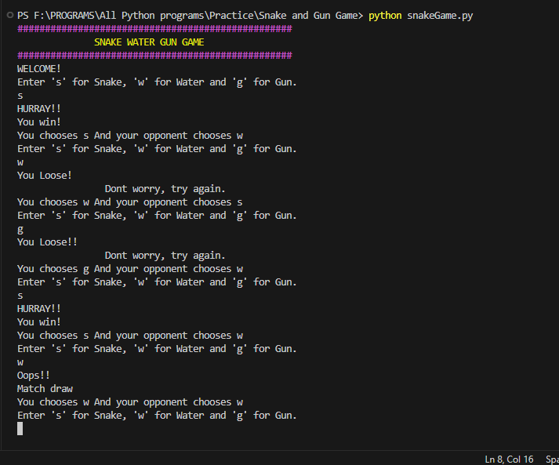

# Snake, Water, and Gun Game

<p align="justify">✍A classic game implemented in Python where you play against the computer in a Snake, Water, Gun game. Each player chooses one of the three items, and the winner is determined by the rules of Snake drinks Water, Gun shoots Snake, and Water douses Gun.</p>

## Features

- Text-based interaction for selecting Snake, Water, or Gun.
- Voice announcement at the start of the game (Windows only).
- Colorful text output for game status messages.
- Play multiple rounds against the computer.
- Keep track of scores and announce the final results.
- Option to replay the game after it ends.

## Prerequisites

To run this game, you'll need Python installed on your system. Additionally, the game uses the `win32com.client` and `termcolor` packages for voice synthesis and colored text output, respectively. Make sure you have these installed:

```bash
pip install pypiwin32 termcolor
```

### How to Play
- Start the game by running the Python script:
```
python your-file-name.py
```
- 1. When prompted, enter 's' for Snake, 'w' for Water, or 'g' for Gun.
- 2. The game will announce whether you've won, lost, or drawn the round against the computer.
- 3. After 10 rounds, your final score and the computer's score will be displayed.
- 4. You'll be given an option to play again or exit the game.

### Rules
- Snake vs. Water: Snake drinks the water, hence Snake wins.
- Water vs. Gun: Water douses Gun, hence Water wins.
- Gun vs. Snake: Gun shoots Snake, hence Gun wins.


##### Enjoy the game, and may the best player win!


### Output Screen

- Commond prompt screen.
#### input
  